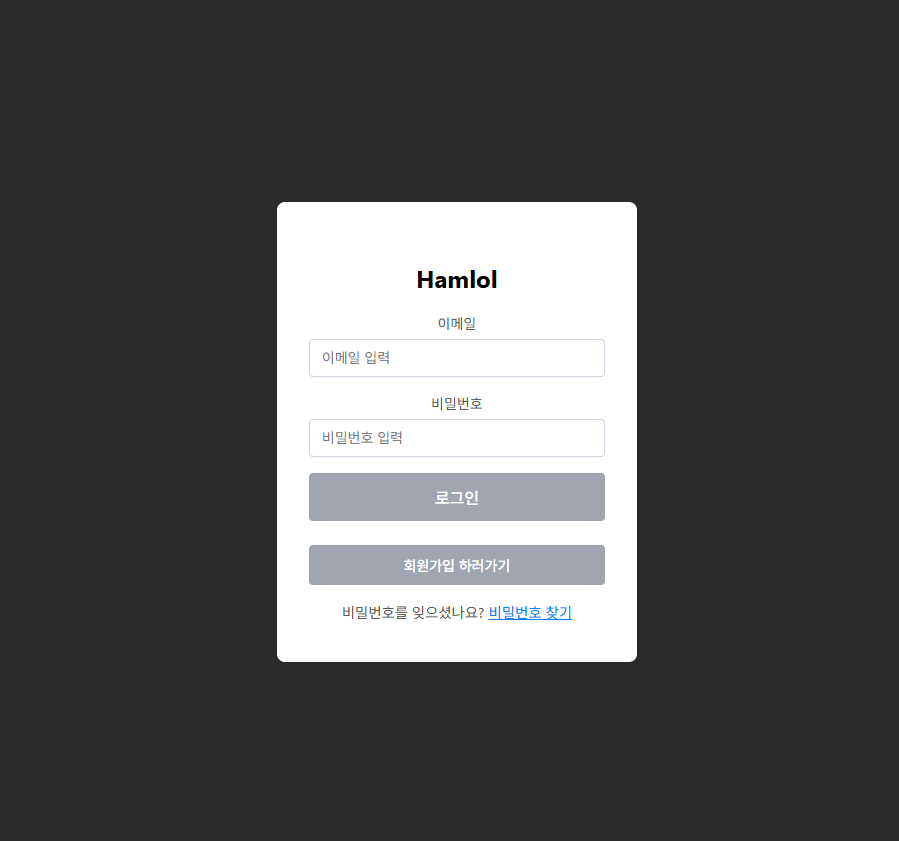
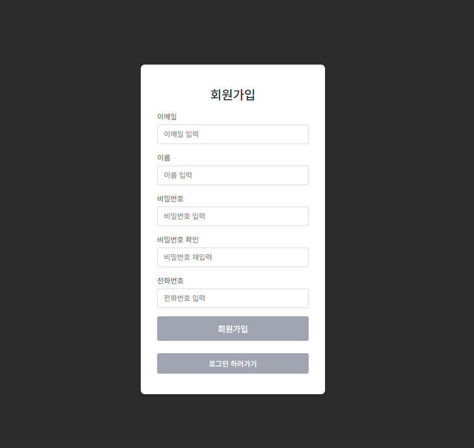
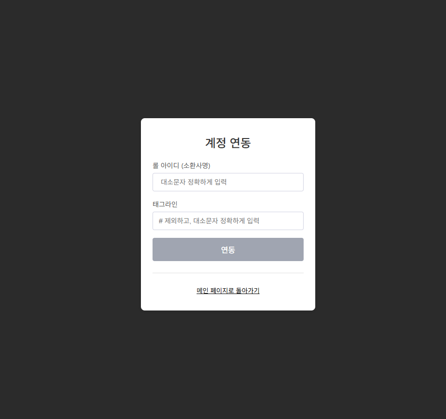
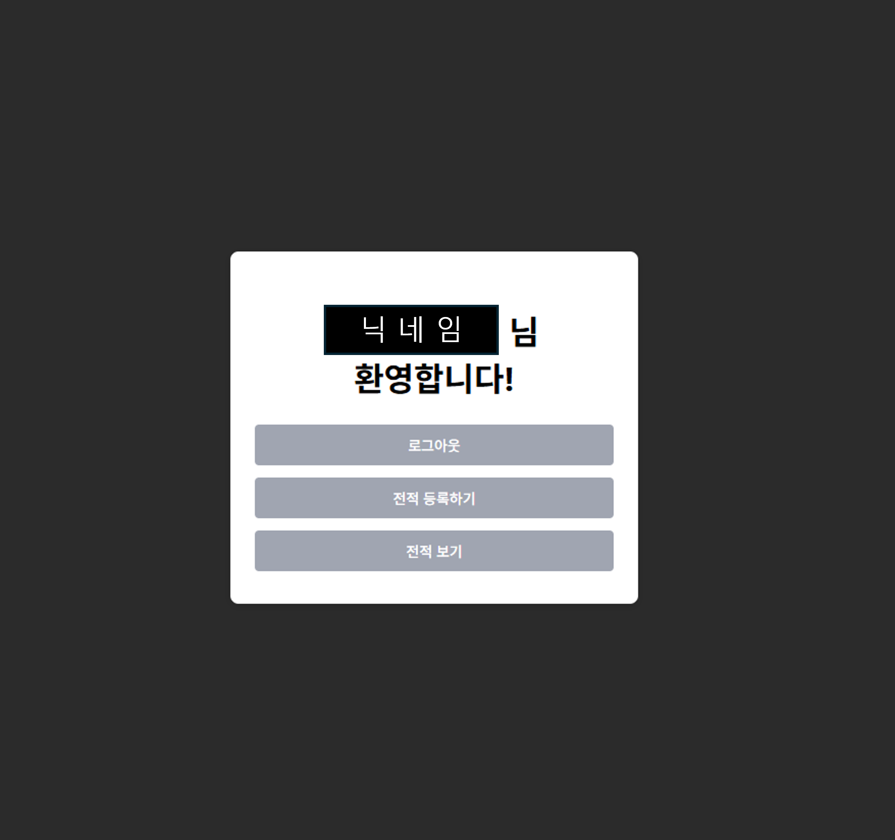
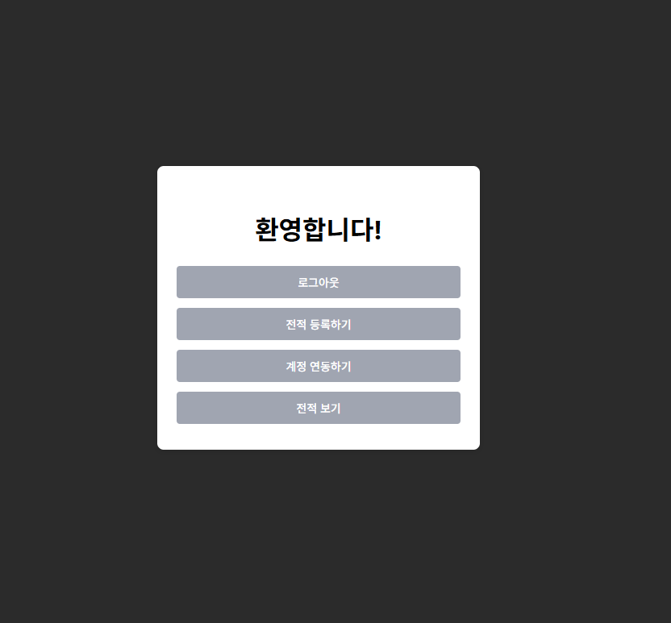
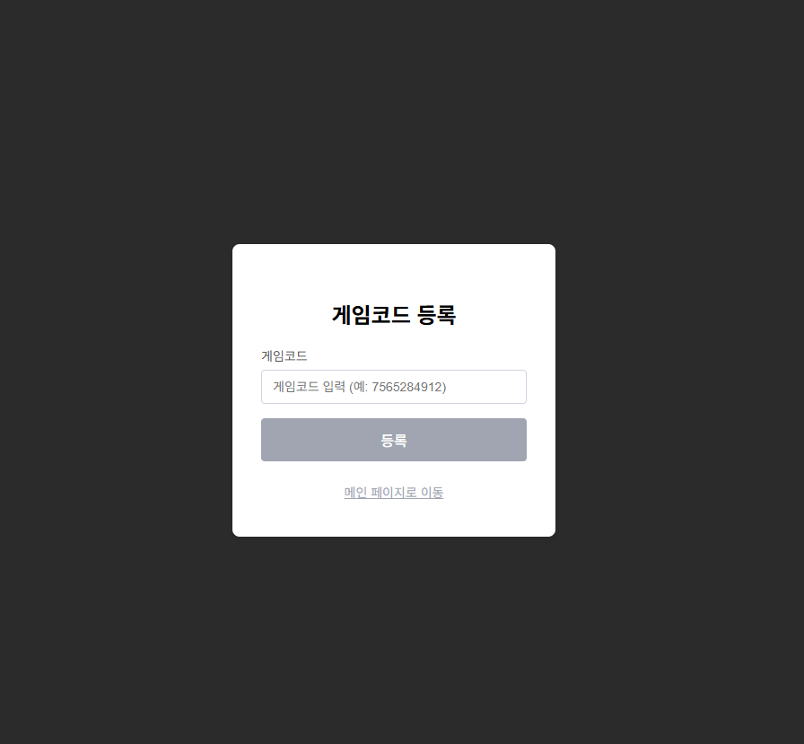
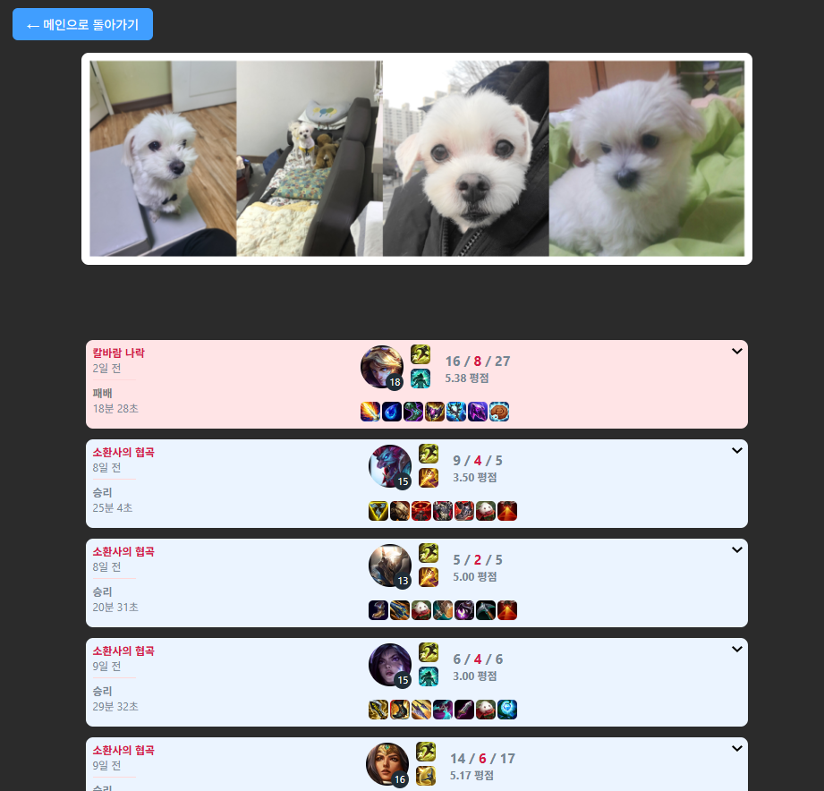
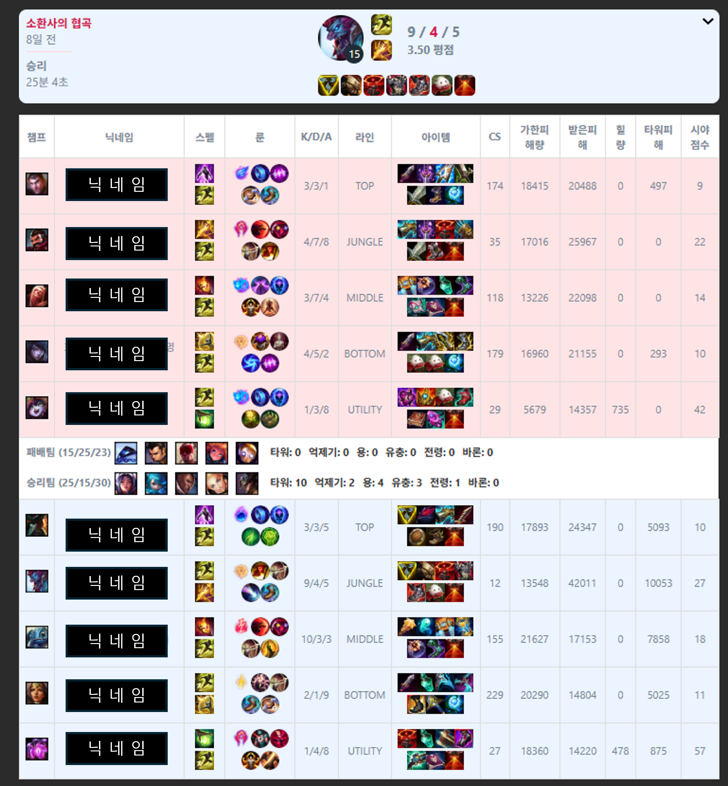

D# 🎮 hamlol.xyz | 리그 오브 레전드 전적 저장 플랫폼

**hamlol.xyz**는 리그 오브 레전드 플레이어가 자신의 게임 전적을 저장하고 조회할 수 있는 **통합 전적 관리 플랫폼**입니다. Riot API 연동, JWT 인증,  Docker & GitHub Actions 기반 CI/CD 자동화 등 실무 수준의 기술 스택을 적용한 개인 프로젝트입니다.

---

## 🗓 프로젝트 개요

| 항목          | 내용                                                                     |
| ----------- | ---------------------------------------------------------------------- |
| 📆 개발 기간    | 2024.03.01 \~ ∞                                                        |
| 👨‍💼 개발 인원 | 1명 (개인 프로젝트)                                                           |
| 🔗 배포 주소    | [hamlol.xyz](http://hamlol.xyz/login)                               |
| 📂 GitHub | [https://github.com/ryu1002/hamlol](https://github.com/ryu1002/hamlol)   |
| 🗂 Notion | [Notion](https://www.notion.so/hamlol-gg-1a4ba840cadf806ab06df45e9993ce9f) |

---

## 🌟 기획 배경

* 리그 오브 레전드 사용자 설정 게임 은 전적사이트에 기록이 남지 않아 기록을 남기고자 함
* Riot API, JWT, Redis 등 다양한 기술을 학습하고 통합하기 위한 실습 목적


## ⚙️ 사용 기술 스택

🧠 Language 
<p>   </p>
🧹 Backend
<p>       </p>
💻 Frontend
<p>    </p>
🐘 Database
<p>  </p>
⚙️ DevOps & Infra
<p>      </p>
🛠 Tools
<p>      </p>

🌐 API 연동 기능
본 프로젝트에서는 Riot API를 사용하여 실제 게임 데이터를 불러와 사용합니다.

|    API     |   설명   |
| ----------- | ---------------------------------------------------------------------- |
| 🔑 Riot API | Summoner	소환사 정보 (gameName, tagLine, puuid) 불러오기 |
| 🎮  Riot API | Match	MatchDto 기반 전체 매치 정보 불러오기 |
| 👥  Riot API | Participant	플레이어별 전적 데이터 추출 |


## 📁 폴더 구조

```
📦hamlol
┣ 📂.github                 # GitHub Actions 설정
┃ ┗ 📂workflows
┃   ┗ 📜gradle.yml          # CI 빌드 설정
┣ 📂backend                # Spring Boot 백엔드
┃ ┣ 📂build                # 빌드 결과물 폴더
┃ ┣ 📂out                  # 컴파일된 클래스 파일 등
┃ ┗ 📂src
┃   ┗ 📂main
┃     ┣ 📂java
┃     ┃ ┗ 📂org.example.hamlol
┃     ┃   ┣ 📂config       # Security, Redis, Logging 등 설정 클래스
┃     ┃   ┣ 📂controller   # REST API 컨트롤러
┃     ┃   ┣ 📂dto          # 데이터 전송 객체 (Request/Response DTO)
┃     ┃   ┣ 📂entity       # JPA 엔티티 (DB 테이블 매핑)
┃     ┃   ┣ 📂jwt          # JWT 인증 관련 클래스
┃     ┃   ┣ 📂repository   # JPA Repository 인터페이스
┃     ┃   ┣ 📂service      # 서비스 계층 (비즈니스 로직)
┃     ┃   ┃ ┗ 📂impl       # 서비스 구현체
┃     ┃   ┣ 📂urlenum      # Riot API Enum 및 상수 관리
┃     ┃   ┗ 📜HamlolApplication.java # Spring Boot 실행 클래스
┃     ┗ 📂resources
┃       ┣ 📂static         # 정적 리소스 (html, css 등)
┃       ┗ 📜application.yml # Spring 설정 파일
┣ 📂frontend               # React 프론트엔드
┃ ┣ 📂hamlolweb
┃ ┃ ┣ 📂build             # 빌드 결과물
┃ ┃ ┣ 📂src               # 실제 소스코드
┃ ┃ ┃ ┣ 📂assets          # 배너 사진
┃ ┃ ┃ ┣ 📜App.js
┃ ┃ ┃ ┣ 📜App.css
┃ ┃ ┃ ┣ 📜Login.js        # 로그인 페이지
┃ ┃ ┃ ┣ 📜Signup.js       # 회원가입 페이지
┃ ┃ ┃ ┣ 📜Main.js         # 메인 페이지
┃ ┃ ┃ ┣ 📜GameList.js     # 게임 리스트
┃ ┃ ┃ ┣ 📜SaveGame.js     # 전적 저장
┃ ┃ ┃ ┣ 📜FindPassword.js # 비밀번호 찾기
┃ ┃ ┃ ┣ 📜ResetPassword.js# 비밀번호 재설정
┃ ┃ ┣ 📂images
┃ ┃ ┃ ┗ 📂hamlol          # 리드미 삽입용 이미지 저장 위치
┃ ┃ ┃ ┗ 📂Tech Stack      # 기술 스택 아이콘 이미지 폴더
┃ ┃ ┗ 📜README.md         # 프론트 리드미
┣ 📂nginx                 # Nginx 설정 폴더
┃ ┗ 📜nginx.conf          # 리버스 프록시 설정
┣ 📜Dockerfile            # 전체 프로젝트용 도커파일
┣ 📜README.md             # 메인 프로젝트 리드미


```


## 📊 ERD 및 데이터 설계

Riot API의 MatchDto → InfoDto → ParticipantDto / TeamDto 를 기준으로 형태화한 3계층 구조 데이터 설계

### 테이블 관계 요약

```
[User Table]
 ├── 1:1 ──> [Lol Table]         📘 (Riot 소환사 정보)
 ├── 1:N ──> [Api Key Table]     🔑 (Riot API 키)
 ├── 1:N ──> [Match Table]       🎮 (유저 전적)
 ├── 1:N ──> [Champ Table]       🧠 (챔피언 통계)
 └── 1:N ──> [RecentUser Table]  🧑‍🤝‍🧑 (최근 플레이 유저)

[Match Table]
 └── 1:N ──> [Team Table]        🔵🔴 (블루/레드 팀 정보)
       └── 1:N ──> [Player Table] 🧑‍💻 (플레이어별 전적)


```

## 🧱 테이블 구조 및 설명

| 📁 테이블명           | 📝 설명 |
|----------------------|--------|
| **User Table**        | 회원의 ID, 비밀번호, 이메일, 전화번호 등 기본 계정 정보를 저장 |
| **Lol Table**         | Riot API로 받은 소환사명, 태그, 회원 ID, PUUID 정보를 저장 (`puuid` 기준 유저 식별) |
| **Api Key Table**     | 사용자의 Riot API Key를 저장하는 테이블 (개별 요청 인증용) |
| **Champ Table**       | Riot 챔피언의 고정 정보 (`id`, `key`, `name`)를 담은 마스터 테이블 |
| **RecentUser Table**  | 최근 함께 게임한 유저의 ID, 게임 수, 승률을 저장 |
| **Match Table**       | Riot `MatchDto` 기반 전적 요약 테이블로, 게임 ID, 날짜, 게임 모드, 진행 시간 등을 저장 |
| **Team Table**        | 각 매치에 포함된 팀(블루/레드)의 승패, 오브젝트(드래곤/타워/바론 등) 처치, 밴 목록 등을 저장 |
| **Player Table**      | 각 팀 소속 플레이어의 전적 데이터(챔피언, 포지션, 아이템, KDA, 골드, 룬, 피해량, 회복량, 미니언 수, 시야 점수, 와드 설치/제거 수, 승리 여부 등)를 저장 |


### ERD 이미지 첨부


---


## 🚀 주요 기능


## 🔐 로그인 (JWT 인증) <br>

✅ 로그인 API :POST /api/login <br>
- 이메일 + 비밀번호 기반 로그인 API (POST /api/login) <br>
- Spring Security + JWT 기반 인증 처리 <br>
- 로그인 성공 시 JWT 토큰 발급 → LocalStorage 저장 <br>
- 계정 연동 여부(gameName, tagLine)도 함께 토큰에 포함 <br>
- JWT 토큰 발급은 사용자 인증 → 계정 정보 조회 → JwtTokenProvider로 토큰 생성 순서로 진행됩니다. <br>

## 📝 회원가입 <br>

✅ 회원가입 API : POST /api/adduser <br>
- 회원가입 API (POST /api/adduser) 사용 <br>
- 이메일, 비밀번호, 닉네임을 입력받아 등록 <br>
- 비밀번호는 BCryptPasswordEncoder로 암호화 후 DB 저장 <br>
- 입력값 유효성 검사 (프론트/백 동시에 검증) <br>
- 성공 시 로그인 페이지로 자동 이동 <br>
- DTO → Entity 변환 후 DB 저장, 실패 시 예외 메시지 반환 <br>


## ⚙️ 계정 연동 <br>

✅ 계정 연동 API : POST /api/account <br>
- 사용자가 입력한 gameName, tagLine을 통해 Riot API 호출 <br>
- 응답으로 받은 puuid를 추출 후 사용자 계정과 함께 DB에 저장 <br>
- 연동 성공 시 메인 페이지에 게임 닉네임 표시<br>

 <br>
✅ 저장 시 본인의 게임 ID가 포함된 게임만 저장 가능하도록 검증, 메인화면에 닉네임 표시 <br>


## 🧾 메인 페이지 <br>
 <br>

- JWT 토큰을 jwt-decode 라이브러리로 디코딩하여 로그인된 사용자 정보 확인 <br>
- 계정 연동 여부 확인 후 연동되지 않았을 경우 "계정 연동하기" 버튼 노출 <br>
- 연동된 경우 gameName#tagLine 형식의 닉네임을 상단에 출력 <br>
- 주요 기능 페이지로 이동 가능한 링크 제공 <br>
 - 전적 등록하기 <br>
 - 전적 보기 <br>
 - 로그아웃 <br>
✅ 연동 여부는 JWT 내 gameName, tagLine 값을 기준으로 판단 <br>

 
## 🕹️ 전적 저장<br>
 <br>
- Riot API를 호출하여 최근 경기 정보 조회 <br>
- 로그인한 사용자의 Riot 계정과 일치하는 게임만 검증 후 저장 <br>
- 게임 전적을 Match / Team / Player 테이블에 분할 저장 <br>
### ✅ 전적 저장 조건: <br>
- 로그인한 사용자의 Riot ID(gameName, tagLine)가 경기 참가자 중에 포함되어야 함 <br>
- 포함되지 않을 경우 예외 발생 후 저장 불가 처리 <br>

### 🛠️ 저장 처리 흐름: <br>
```
1. 로그인한 사용자의 이메일 → 연동된 Riot 계정 정보 조회
2. 입력받은 Match ID 기반 Riot API 호출 → 전체 경기 정보 수신
3. 본인 Riot ID 포함 여부 확인
4. 참여자 정보(룬, 아이템, 킬/데스 등) 및 팀 정보 추출
5. Match, Team, Player 테이블에 저장
```
💡 JPA Repository 사용 <br>
- matchRepository.save(), teamRepository.saveAll(), playerRepository.saveAll()을 통해 각각 저장 <br>
- 룬 이미지 아이콘 URL은 Riot API에서 추가로 호출하여 필드 매핑 <br>

## 📋 전적 조회 <br>
 <br>
✅ 전적 조회 API : POST /api/bygameid <br>
- 저장된 게임 리스트를 페이지네이션으로 조회 <br>
- 사용자의 Riot 계정 정보(gameName, tagLine)를 기준으로 전적 불러오기 <br>
- 각 전적 클릭 시 상세 페이지로 이동 <br>


### 🛠️ 처리 흐름: <br>
```
1. JWT 토큰 내 사용자 정보에서 gameName, tagLine 추출
2. DB에서 해당 사용자와 일치하는 전적 리스트 조회
3. SimpleGameDTO 형태로 반환하여 리스트 렌더링
```
💡 Spring Data JPA의 Pageable을 활용한 전적 페이징 처리 <br>
💡 Riot API가 아닌, 저장된 내부 DB 기준으로 조회 수행 <br>

## 📊 전적 상세 조회 <br>
 <br>
✅ 상세 조회 API : POST /api/bymatchid <br>
- 개별 매치의 모든 정보 출력 (팀별 / 플레이어별) <br>
- 블루팀 vs 레드팀 비교 뷰 제공 <br>
- Ban 정보도 챔피언 ID → 이름으로 변환 처리 <br>


### 🛠️ 처리 흐름: <br>
```
1. 클라이언트로부터 matchId 수신
2. DB에서 해당 matchId 기반 팀/플레이어 정보 조회
3. 챔피언 Ban ID를 Riot 챔피언 이름으로 매핑
4. GameRecordDTO로 변환 후 응답 반환
```
💡 ChampService를 통해 Riot 챔피언 데이터를 사전에 수집 및 캐싱 <br>
💡 ObjectMapper + JsonNode 사용으로 Ban JSON 동적 처리 <br>


## 🛡️ 관리자 / 보안 설정

- Spring Security 기반 JWT 인증 시스템 적용 <br>
- 미인증 사용자의 API 접근 차단<br>
- 인증 실패 시 401 / 403 응답 반환 (Custom EntryPoint 처리)<br>
- JWT 필터를 UsernamePasswordAuthenticationFilter 앞에 적용<br>

---


---

## 🌐 CI/CD 자동화 파이프라인

```
🔀 GitHub Push →
⚙ GitHub Actions →
😳 Docker Image Build →
📄 DockerHub Push →
🔐 EC2 접속 (pem) →
📦 기존 컨테이너 종료 →
🚀 새 컨테이너 실행
```

---

---

## 📈 확장 계획 (Future Work)

* 비밀번호 찾기 기능 개선 (React routing + API)
* 사용자별 전적 통계 시각화 
* 랭킹 시스템, 리그 등급 도입
* 사용자별 승률 분석, 포지션별 성과 등 추가 예정


