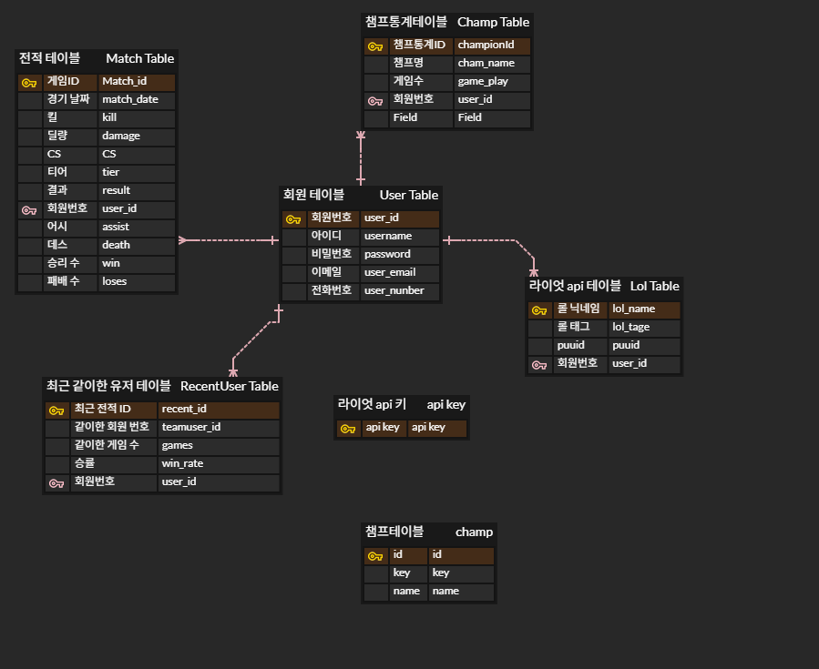
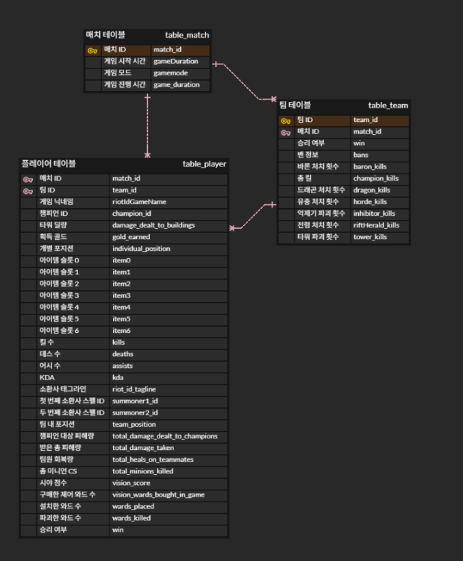

# 🎮 hamlol.xyz | 리그 오브 레전드 전적 저장 플랫폼

**hamlol.xyz**는 리그 오브 레전드 플레이어가 자신의 게임 전적을 저장하고 조회할 수 있는 **통합 전적 관리 플랫폼**입니다. Riot API 연동, JWT 인증, Redis 기반 비밀번호 재설정, Docker & GitHub Actions 기반 CI/CD 자동화 등 실무 수준의 기술 스택을 적용한 개인 프로젝트입니다.

---

## 🗓 프로젝트 개요

| 항목          | 내용                                                                     |
| ----------- | ---------------------------------------------------------------------- |
| 📆 개발 기간    | 2024.03.01 \~ ∞                                                        |
| 👨‍💼 개발 인원 | 1명 (개인 프로젝트)                                                           |
| 🔗 배포 주소    | [hamlol.xyz](http://hamlol.xyz/login)                               |
| 📂 GitHub | [https://github.com/ryu1002/hamlol](https://github.com/ryu1002/hamlol)   |
| 🗂 상세 포트폴리오 | [Notion 포트폴리오 보기](https://www.notion.so/hamlol-gg-1a4ba840cadf806ab06df45e9993ce9f) |

---

## 🌟 기획 배경

* 리그 오브 레전드 사용자 설정 게임(내전) 은 전적사이트에 기록이 남지 않아 기록을 남기고자 함
* Riot API, JWT, Redis 등 다양한 기술을 학습하고 통합하기 위한 실습 목적

---

## 🚀 주요 기능

### ✅ 사용자 인증

* 이메일 기반 회원가입 및 로그인 (JWT)

### ✅ 전적 저장 및 조회

* Riot API 연동 후 게임 전적 조회
* 자신의 리그 오브 레전드 ID와 일치하는 게임만 저장
* 저장된 게임 리스트 조회 및 상세 정보 확인

### ✅ 계정 연동

* 저장 시 본인의 리그 오브 레전드 ID 포함 유무를 판별하여 검증

### ✅ 관리자/보안 설정

* Spring Security로 미인증 사용자 접근 차단
* `/error`, `/login`, `/signup` 등 예외 경로 처리
* 정적 리소스 접근 허용 및 403/401 핸들링

---

## ⚙️ 사용 기술 스택

🧠 Language 
<p>   </p>
🧹 Backend
<p>       </p>
💻 Frontend
<p>    </p>
🐘 Database
<p>  </p>
⚙️ DevOps & Infra
<p>      </p>
🛠 Tools
<p>      </p>
## 📁 폴더 구조

```
📦hamlol
┣ 📂.github                 # GitHub Actions 설정
┃ ┗ 📂workflows
┃   ┗ 📜gradle.yml          # CI 빌드 설정
┣ 📂backend                # Spring Boot 백엔드
┃ ┣ 📂build                # 빌드 결과물 폴더
┃ ┣ 📂out                  # 컴파일된 클래스 파일 등
┃ ┗ 📂src
┃   ┗ 📂main
┃     ┣ 📂java
┃     ┃ ┗ 📂org.example.hamlol
┃     ┃   ┣ 📂config       # Security, Redis, Logging 등 설정 클래스
┃     ┃   ┣ 📂controller   # REST API 컨트롤러
┃     ┃   ┣ 📂dto          # 데이터 전송 객체 (Request/Response DTO)
┃     ┃   ┣ 📂entity       # JPA 엔티티 (DB 테이블 매핑)
┃     ┃   ┣ 📂jwt          # JWT 인증 관련 클래스
┃     ┃   ┣ 📂repository   # JPA Repository 인터페이스
┃     ┃   ┣ 📂service      # 서비스 계층 (비즈니스 로직)
┃     ┃   ┃ ┗ 📂impl       # 서비스 구현체
┃     ┃   ┣ 📂urlenum      # Riot API Enum 및 상수 관리
┃     ┃   ┗ 📜HamlolApplication.java # Spring Boot 실행 클래스
┃     ┗ 📂resources
┃       ┣ 📂static         # 정적 리소스 (html, css 등)
┃       ┗ 📜application.yml # Spring 설정 파일
┣ 📂frontend               # React 프론트엔드
┃ ┣ 📂hamlolweb
┃ ┃ ┣ 📂build             # 빌드 결과물
┃ ┃ ┣ 📂src               # 실제 소스코드
┃ ┃ ┃ ┣ 📂assets          # 배너 사진
┃ ┃ ┃ ┣ 📜App.js
┃ ┃ ┃ ┣ 📜App.css
┃ ┃ ┃ ┣ 📜Login.js        # 로그인 페이지
┃ ┃ ┃ ┣ 📜Signup.js       # 회원가입 페이지
┃ ┃ ┃ ┣ 📜Main.js         # 메인 페이지
┃ ┃ ┃ ┣ 📜GameList.js     # 게임 리스트
┃ ┃ ┃ ┣ 📜SaveGame.js     # 전적 저장
┃ ┃ ┃ ┣ 📜FindPassword.js # 비밀번호 찾기
┃ ┃ ┃ ┣ 📜ResetPassword.js# 비밀번호 재설정
┃ ┃ ┣ 📂images
┃ ┃ ┃ ┗ 📂hamlol          # 리드미 삽입용 이미지 저장 위치
┃ ┃ ┃ ┗ 📂Tech Stack      # 기술 스택 아이콘 이미지 폴더
┃ ┃ ┗ 📜README.md         # 프론트 리드미
┣ 📂nginx                 # Nginx 설정 폴더
┃ ┗ 📜nginx.conf          # 리버스 프록시 설정
┣ 📜Dockerfile            # 전체 프로젝트용 도커파일
┣ 📜README.md             # 메인 프로젝트 리드미


```

---

## 🌐 CI/CD 자동화 파이프라인

```
🔀 GitHub Push →
⚙ GitHub Actions →
😳 Docker Image Build →
📄 DockerHub Push →
🔐 EC2 접속 (pem) →
📦 기존 컨테이너 종료 →
🚀 새 컨테이너 실행
```

---

## 📊 ERD 및 데이터 설계

Riot API의 MatchDto → InfoDto → ParticipantDto / TeamDto 를 기준으로 형태화한 3계층 구조 데이터 설계

### 테이블 관계 요약

```
[User Table]
   ├── 1:1 ──> [Lol Table] (Riot 소환사 정보)
   ├── 1:N ──> [Api Key Table]
   ├── 1:N ──> [Match Table]
   ├── 1:N ──> [Champ Table] (챔피언 통계)
   └── 1:N ──> [RecentUser Table]

[Match Table]
   └── 1:N ──> [Team Table]
                  └── 1:N ──> [Player Table]

```

🔗 테이블 구조 및 설명
🗂️ 테이블명	🔍 설명
User Table	회원의 ID, 비밀번호, 이메일, 전화번호 등 기본 계정 정보를 저장
Lol Table	Riot API로부터 받은 소환사명, 태그, PUUID 정보를 저장 (puuid 기반 식별)
Api Key Table	Riot 개발자 API Key 관리용 테이블 (사용자별 API 키 저장)
Champ Table	사용자의 챔피언별 게임 수, 통계를 저장하여 챔피언 분석에 활용
RecentUser Table	최근 함께 플레이한 사용자 ID, 게임 수, 승률 등을 기록
Match Table	Riot MatchDto 기반의 전적 요약 테이블, 게임 ID, 날짜, 킬/데스, 결과 등을 저장
Team Table	하나의 매치에 포함된 **각 팀(블루/레드)**의 정보, 승패, 드래곤/타워 처치 등
Player Table	각 팀 소속 플레이어의 개별 전적 데이터: 챔피언, 포지션, 아이템, KDA 등
Champ	Riot 챔피언의 **기본 고정 정보(id, key, name)**를 담은 마스터 테이블
Match	Riot의 MatchDto 기반 구조로, 게임 시작 시간, 모드, 진행 시간 등을 저장


### ERD 이미지 첨부






---

## 💡 Riot API 연동 구조

```
Riot API (MatchDto)
  ↓
MatchServiceImpl
  ↓
Entity 변환 후 DB 저장
  ↓
사용자 조회 및 전적 분석 제공
```

Riot의 ParticipantDto, TeamDto, InfoDto의 구조를 기반으로 각각의 DB 테이블 컬럼이 어떻게 매핑되는지를 명확하게 매핑되도록 설계하였다 또는 테이블 컬럼과 API 필드 간 관계를 정의하였다
---

## 📈 확장 계획 (Future Work)

* 비밀번호 찾기 기능 개선 (React routing + API)
* 사용자별 전적 통계 시각화 (PieChart, BarChart 등)
* 랭킹 시스템, 리그 등급 도입
* 사용자별 승률 분석, 포지션별 성과 등 추가 예정

---

## 🔧 How To Use

```
# 프로젝트 클론
$ git clone https://github.com/ryu1002/hamlol.git

# 프로젝트 디렉토리로 이동
$ cd hamlol

# React + Spring Boot 다운
(전용 Dockerfile & docker-compose.yml 같은 것이 존재할 경우)
$ docker-compose up --build

# EC2 배포 후 접속 URL 확인
$ http://hamlol.xyz
```

---

